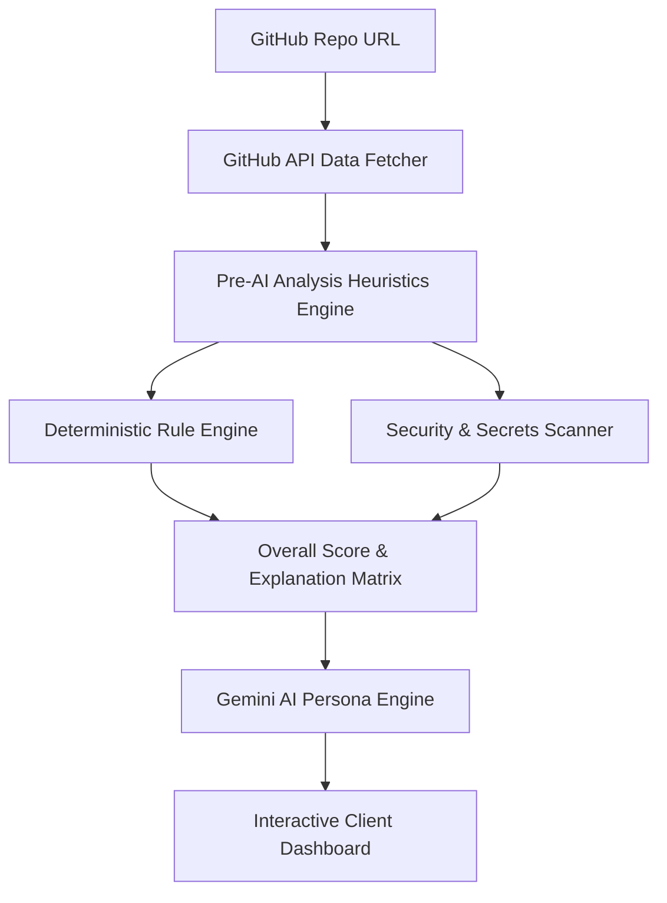

# System Architecture

This document describes the high-level architecture of **DevInspect AI**, detailing components, scoring, security systems, and deployment designs.

---

## Technical Overview

DevInspect AI is structured as a **secure static-serving Node.js Full-Stack Application** comprising a React Single Page Application (SPA) frontend and a hardened Express backend.

---

## Core Components

### 1. Hardened Production Server (`server.js`)
Serves the built SPA static files from `/dist` and enforces security policies:
- **HTTP Security Headers**: Via `helmet` with custom Content Security Policies (CSP) locking resource fetching to `api.github.com` and `generativelanguage.googleapis.com`.
- **API Rate Limiting**: REST paths are throttled using `express-rate-limit` (100 requests per 15 minutes per IP).
- **Session Protections**: Implements cookie hashing and optional multi-user password barriers hashed via `bcryptjs`.

### 2. State & Token Life Cycle Context (`src/context/AppContext.jsx`)
Coordinates global React application state:
- Secrets (`githubToken` and `geminiApiKey`) are stored exclusively in **`sessionStorage`** on the client, ensuring they are discarded automatically when the browser tab closes.
- Local repository historical runs are compiled in `localStorage` securely.

### 3. Pre-AI Heuristics Scanner (`src/services/analyzer.js`)
Extracts telemetry indicators from raw repository data:
- **README Analyzer**: Evaluates headings, screenshots, badges, setup guides, code blocks, and counts word volume.
- **File Tree Analyzer**: Investigates directories, folder depth, presence of test configurations, Docker configurations, and CI/CD pipelines.
- **Secrets Exposure Scanner**: Regularly checks path names and documentation content for committed keys (PEMs, `.env` files, AWS credentials, API key assignments, and JWT hashes).

### 4. Deterministic Rule Engine (`src/services/metrics.js`)
Transforms evidence collections into deterministic scores:
- **README presence**: +15 points
- **Dockerfile presence**: +10 points
- **CI workflow presence**: +10 points
- **Automated Tests present**: +15 points
- **Commit activity & style**: Up to +15 points
- **Project Originality (Non-Clone)**: Up to +15 points
- **Repository Presentation (Metadata)**: Up to +10 points
- **Security Health status**: Up to +10 points (deducts 5 points per exposed secret)

Scores are completely deterministic and transparently listed with evidence strings in the dashboard card layout.

### 5. AI Persona Engine (`src/services/ai.js` & `personas.js`)
Injects repository telemetry findings into a Google Gemini prompt instructions template. It asks the model to formulate distinct, developer-culture-aware feedback across five personas:
- **Senior Engineer**: Focuses on architecture, code quality, testing structure, and code organization.
- **Recruiter**: Focuses on professional presentation, summaries, portfolio appeal, and readme layout.
- **DevOps Veteran**: Focuses on infrastructure stability, container health, CI checks, and deployment logs.
- **Open Source Maintainer**: Focuses on licensing, documentation completeness, setup instructions, and issue templates.
- **Startup CTO**: Focuses on product speed, feasibility, tech debt risk, and business viability.

If Gemini API limits are hit, the application gracefully reverts to rule-based fallback persona feedback templates.
