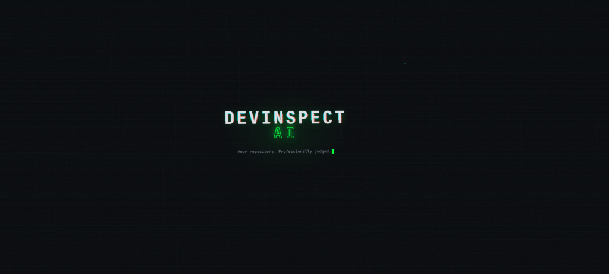
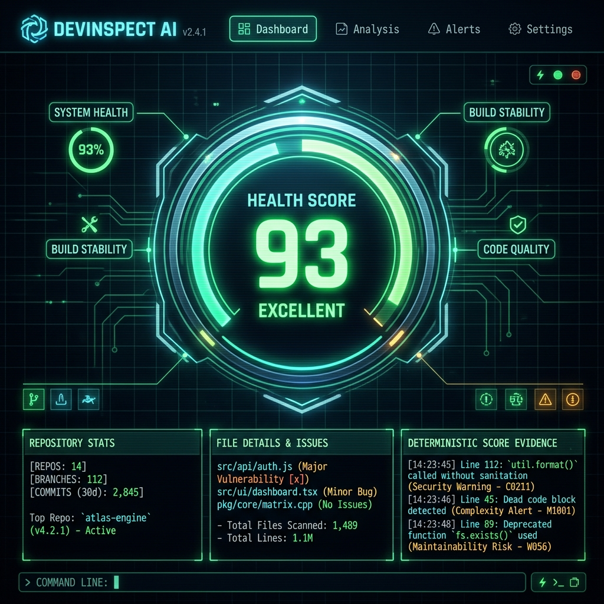
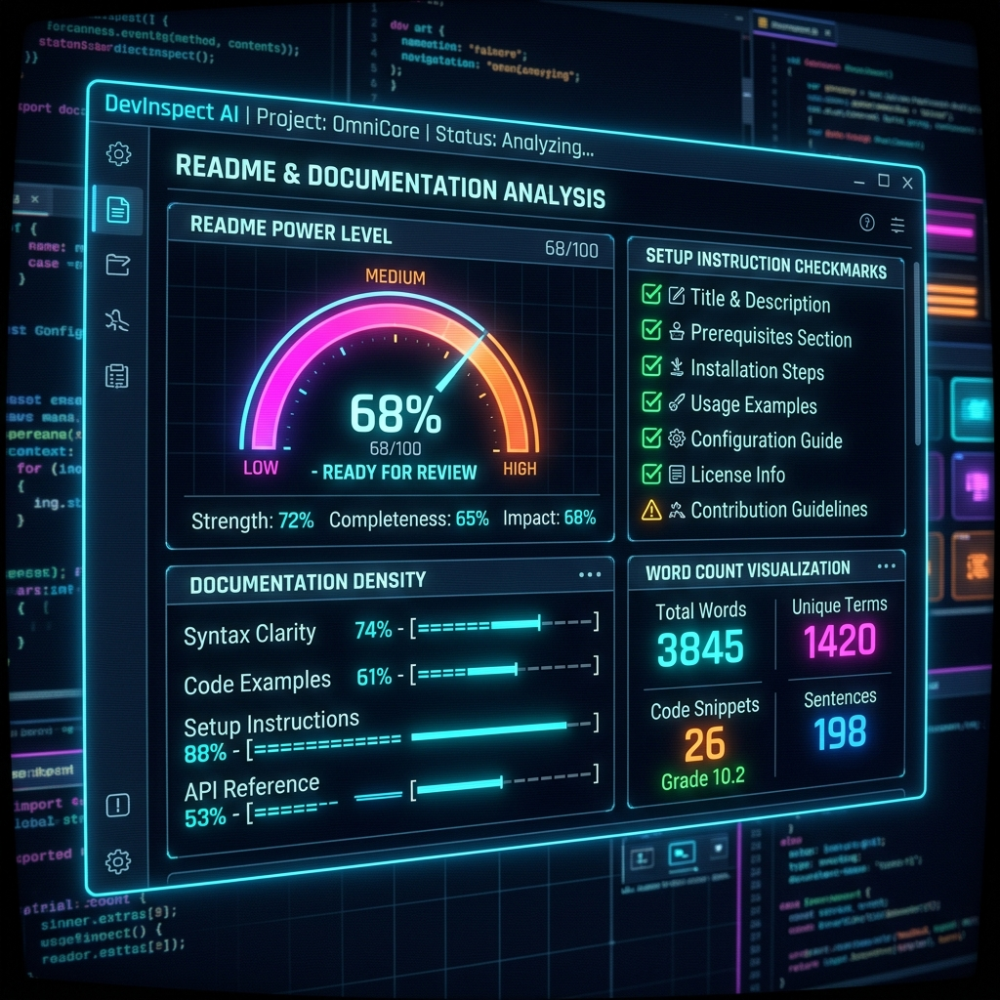
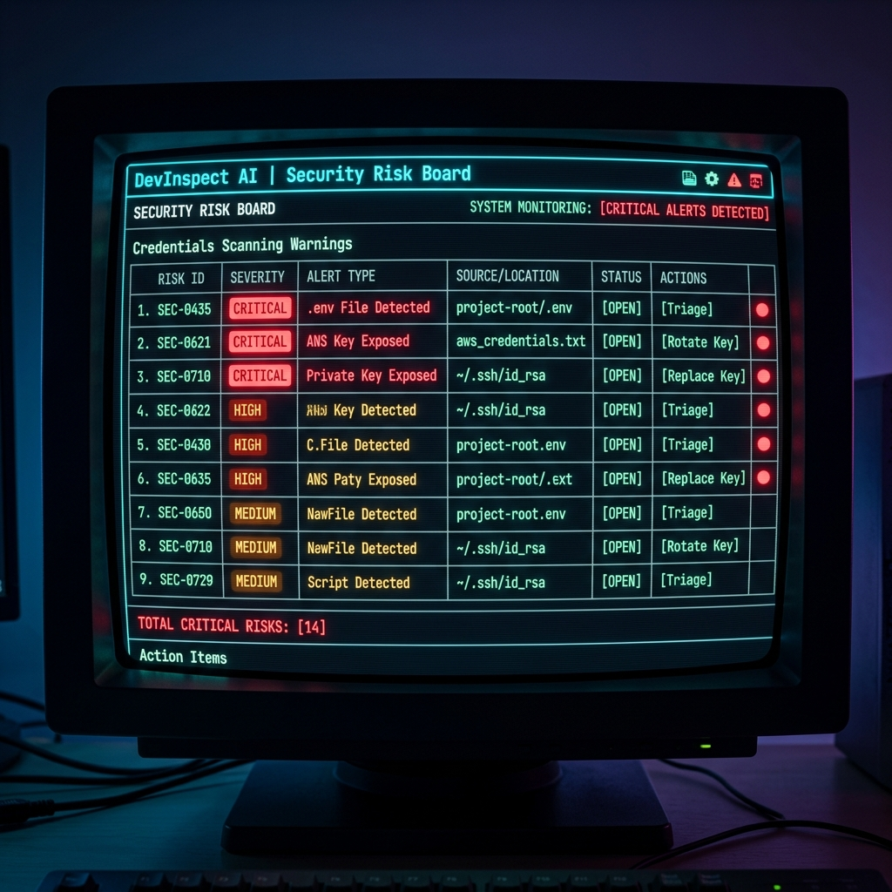
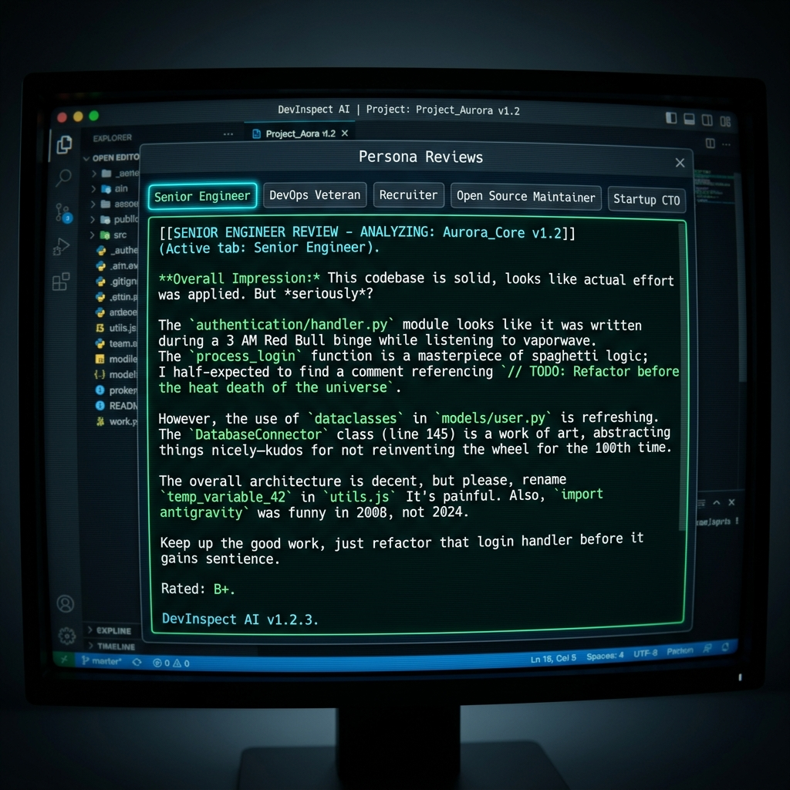
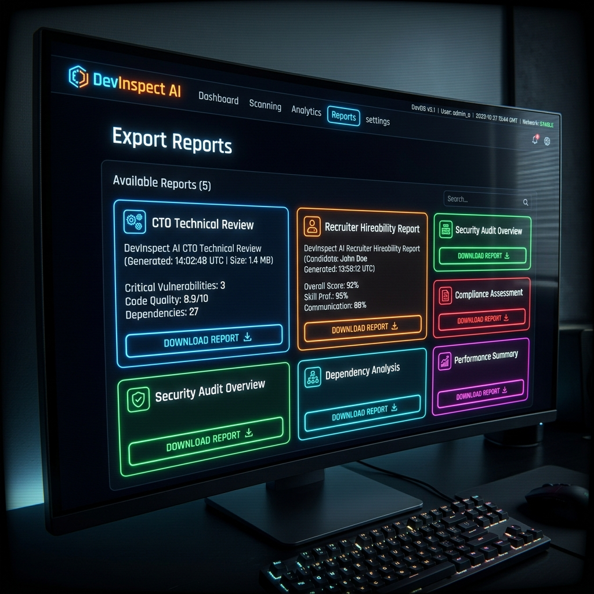
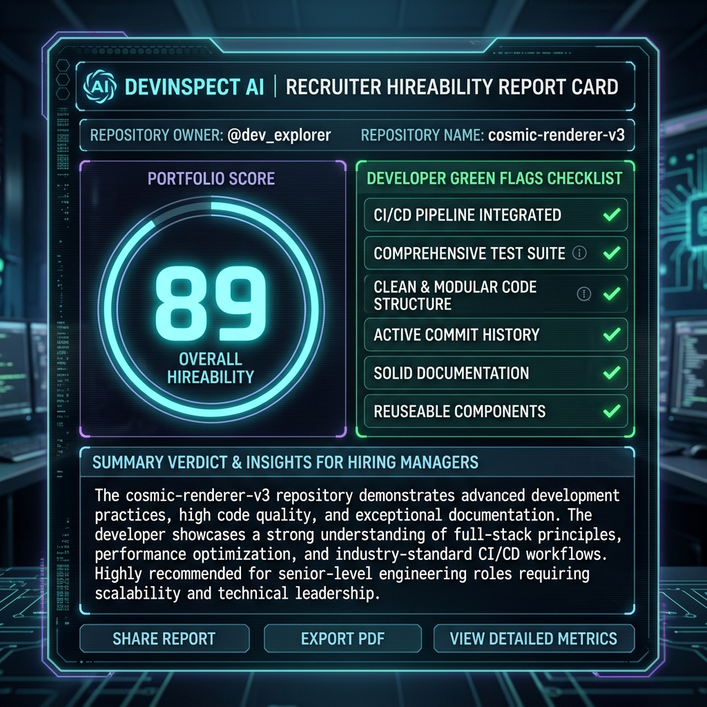
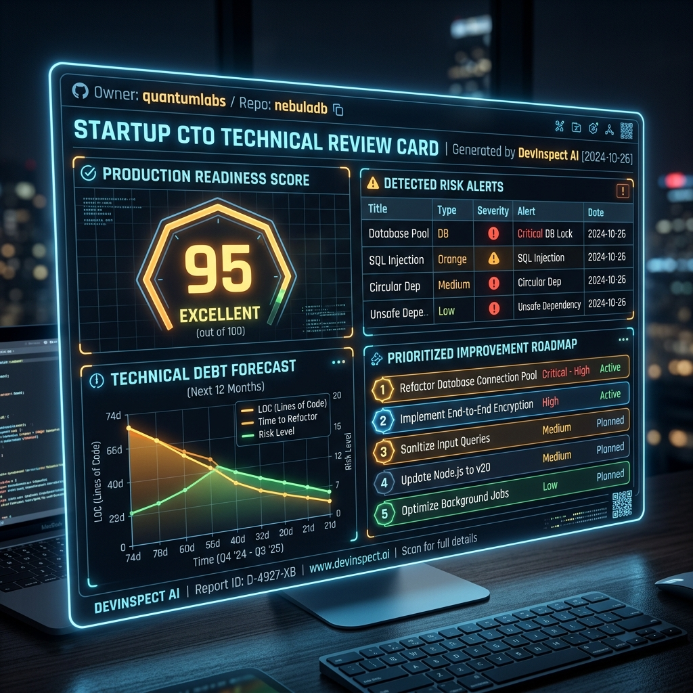

# DevInspect AI — Repository Inspector 🔍🤖

> **"Your repository. Professionally judged by sleep-deprived engineers, recruiters, and CTOs."**

DevInspect AI is an opinionated, client-side, AI-powered GitHub repository scanner. It reviews projects not as generic charts, but the way real humans review them — with skepticism, developer culture awareness, and constructive feedback.

The user interface uses a **handcrafted terminal aesthetic** styled with asymmetric layouts, glowing font rendering, a CRT scanline monitor overlay, and dynamic glitch animations.

---

## 🗺️ Architectural & Data Pipeline Flowchart

Below is the complete flow showing how repository URLs are parsed, fetched, scanned via local heuristic algorithms, evaluated by the AI review engine, and styled with animated interactive elements:

```mermaid
flowchart TD
    %% Define Styles
    classDef user fill:#0a0a0f,stroke:#ffb700,stroke-width:2px,color:#fff;
    classDef parser fill:#111118,stroke:#00e5ff,stroke-width:2px,color:#fff;
    classDef gh fill:#14141e,stroke:#b347d9,stroke-width:2px,color:#fff;
    classDef local fill:#14141e,stroke:#00ff41,stroke-width:2px,color:#fff;
    classDef ai fill:#1a1a24,stroke:#ff3e3e,stroke-width:2px,color:#fff;
    classDef ui fill:#0a0a0f,stroke:#ff6b9d,stroke-width:2px,color:#fff;

    %% Elements
    UserInput["User enters URL<br/>(github.com/owner/repo)"]:::user
    Parser["parseGitHubUrl() Helper<br/>Extracts owner & repo"]:::parser
    StartScan["App.jsx Dispatcher<br/>State: SCANNING"]:::parser
    
    subgraph github_api ["GitHub Parallel Fetch (github.js)"]
        GH_Meta["fetchRepoData()<br/>Stars, forks, dates"]
        GH_Readme["fetchReadme()<br/>Base64 content"]
        GH_Tree["fetchContents()<br/>Recursive file tree"]
        GH_Lang["fetchLanguages()<br/>Language byte ratios"]
        GH_Contribs["fetchContributors()<br/>Top developers list"]
        GH_Commits["fetchCommits()<br/>Recent 30 commit messages"]
    end
    class github_api gh;

    Loader["ASCII Progress Bar<br/>Simulated '██░░' progress logs"]:::ui
    DataCombine["fetchAllRepoData() Resolves<br/>Combined payload object"]:::gh
    
    subgraph heuristics_analyzer ["Pre-AI Heuristic Scanner (analyzer.js)"]
        ReadScan["analyzeReadme()<br/>Screenshots, badges, word counts, setup check"]
        TreeScan["analyzeFileTree()<br/>Depth, tests, docker, CI/CD configs"]
        CloneScan["detectCloneProject()<br/>Tutorial / boilerplate keywords search"]
        BuzzScan["detectBuzzwords()<br/>Hype levels spectrometer"]
    end
    class heuristics_analyzer local;

    MetricsCalc["metrics.js Calculator<br/>Computes 10 witty 0-100 scores"]:::local
    Detections["detection.js Alerts<br/>Missing README, Localhost Veteran, etc."]:::local

    ApiKeyCheck{"Gemini API Key<br/>Configured?"}:::ai
    
    subgraph gemini_engine ["AI Engine (ai.js)"]
        GeminiCall["gemini-2.0-flash API Call<br/>Telemetry injected as context"]
        JsonParse["Structured JSON Output<br/>5 Persona Reviews, Roadmap, Roast"]
    end
    class gemini_engine ai;

    FallbackReview["personas.js Engine<br/>Local rule-based reviews & witty roasts"]:::local
    
    subgraph interaction ["Interactive Display Layout"]
        CRT["CRT Scanline & Noise Overlay"]
        Glitch["Section Headers Glitch Anim"]
        TreeViewer["Collapsible file tree viewer"]
        StatsAnim["Circular Gauge Count-up & Rotations"]
        EasterEggs["Easter Eggs: Grass, Burnout, Recruiter"]
    end
    class interaction ui;

    PngExport["ExportCard.jsx Wrapper<br/>Renders Report Card DOM to canvas"]:::parser
    PngDownload["html2canvas PNG Download<br/>Shareable Social Cards"]:::user

    %% Connections
    UserInput --> Parser
    Parser -- Valid --> StartScan
    Parser -- Invalid --> ShakeAnim["Trigger Shake + Error Screen"]:::ui
    StartScan --> github_api
    StartScan --> Loader
    github_api --> DataCombine
    Loader -- Sync with Actual Resolves --> DataCombine
    DataCombine --> heuristics_analyzer
    heuristics_analyzer --> MetricsCalc
    MetricsCalc --> Detections
    Detections --> ApiKeyCheck
    
    ApiKeyCheck -- Yes --> GeminiCall
    GeminiCall --> JsonParse
    ApiKeyCheck -- No --> FallbackReview
    JsonParse -- Fail Fallback --> FallbackReview
    
    JsonParse --> interaction
    FallbackReview --> interaction
    interaction --> PngExport
    PngExport --> PngDownload
```



---

## 🚀 Key Features

*   **Pre-AI Spec Spectrometer**: Parses file trees and readmes to compute metrics like *Founder Hallucination Severity*, *Technical Debt Forecast*, and *Tutorial Dependency* (catching clone templates).
*   **Gemini AI Inspection**: Feeds repository telemetry to Gemini for highly contextual reviews from 5 distinct personas:
    *   👨‍💻 **Senior Engineer** (practical, architecture-focused)
    *   👔 **Recruiter** (portfolio and hireability-focused)
    *   🔧 **DevOps Veteran** (traumatized, suspicious, docker/CI-focused)
    *   📦 **Open Source Maintainer** (documentation and licenses-focused)
    *   🚀 **Startup CTO** (investor-minded, speed-focused)
*   **Witty Rule-Based Fallbacks**: Don't have a Gemini API key? The local personas engine falls back to generating rule-based developer-humor roasts custom-tailored to your project's stats.
*   **Social Report Cards**: Renders beautiful report templates (CTO Report, Recruiter Card) and exports them locally to high-quality `.png` files using `html2canvas`.
*   **Developer Culture Easter Eggs**: Bouncing DVD corners, burnout level trackers, inactivity recruiter bubbles, and 30-minute "Touch Grass" warnings.

---

## 🔒 Security Hardening & Credentials Shield

DevInspect AI enforces production-grade security standards to protect users and development instances:
*   **Zero Long-Term Token Storage**: All credentials (GitHub PAT and Gemini API Keys) are persisted **exclusively in `sessionStorage`**. They are stored only during the active browser session and are completely discarded on tab refresh, closure, or logout.
*   **Local Heuristics Secrets Scanner**: The analyzer contains a built-in secrets scanner matching rules for `.env` exposures, committed private keys (`.pem`, `.key`, `id_rsa`), AWS access keys, JWT tokens, and hardcoded variables.
*   **Hardened Node Production Server**: Features:
    *   **Helmet.js CSP Configuration**: Employs strict HTTP headers and a robust Content Security Policy, locking script sources and limiting API connections strictly to `api.github.com` and `generativelanguage.googleapis.com`.
    *   **Express Rate Limiter**: Limits endpoints to a maximum of 100 requests per 15 minutes to block DDoS and rate limit abuse.
    *   **Secure Session Cookies**: Implements secure, signed HttpOnly cookies (with `secure: true` in production) to safeguard administrative logins.

---

## 💻 Local Setup & Development

### 1. Prerequisite Checklist
*   **Node.js**: Version 20+ (tested on Node 20 / React 19).
*   **GitHub Token (PAT)** (Optional but recommended): Unauthenticated GitHub limits API requests to 60/hr. In the settings gear, paste a GitHub PAT to raise limits to 5,000/hr.
*   **Gemini API Key** (Optional): Provide a Gemini API key in the settings panel to activate the LLM inspection engine.

### 2. Installation Commands
```bash
# Install project dependencies
npm install

# Start local hot-reloading development server
npm run dev

# Run Vitest test runner
npm run test:run

# Run linter checks
npm run lint

# Compile production-ready builds
npm run build
```

---

## 🐳 Docker Deployment & Hardening

DevInspect AI can be built and run in a fully containerized, secure production container.

### 1. Docker Build
To compile the multi-stage, security-hardened production image running under the non-root `node` user:
```bash
docker build -t devinspect-ai:latest .
```

### 2. Docker Compose Execution
To start the application locally with automated health monitoring checks:
```bash
docker compose up -d
```
The interface will be hosted at `http://localhost:3000`.

---

## 🧪 Testing Suite & CI/CD

DevInspect AI has a fully configured Vitest suite validating metrics, scanners, component renderings, and easter eggs.

### 1. Running Tests
To run all tests:
```bash
npm run test:run
```

To run tests with code coverage metrics:
```bash
npm run coverage
```

### 2. GitHub Actions Pipeline
A CI/CD validation pipeline is defined in `.github/workflows/ci.yml`. It runs automatically on pull requests and pushes to `main` to:
1. Lint the codebase (`npm run lint`).
2. Run all tests and verify coverage reports (`npm run coverage`).
3. Compile the production Docker image to ensure container building succeeds.

---

## 🛠️ Technology Stack

| Layer | Technology | Details |
| ----- | ---------- | ------- |
| **Frontend Core** | React 19 + Vite 8 | Ultra-fast SPA scaffolding |
| **Styling** | Vanilla CSS Modules | Scope-isolated custom classes |
| **Animations** | Motion (Framer Motion) | Hardware-accelerated fluid motion transitions |
| **Backend Core** | Node.js + Express 5 | High-performance API server |
| **Security Headers** | Helmet.js v8 | CSP validation and X-Frame limits |
| **Unit Testing** | Vitest 4 + V8 | Test-driven metrics validation |
| **Containerization** | Docker + Compose | Multi-stage Alpine node runtime |

---

## 🗺️ Product Roadmap

- [ ] **GitHub OAuth Integration**: Transition from manual PAT inputs to standard, OAuth-based token authorization.
- [ ] **Multi-Git Providers Support**: Expand heuristic scanners and API integrations to support GitLab and Bitbucket repositories.
- [ ] **Abstract Syntax Tree (AST) Parsing**: Incorporate local Javascript/Python AST parsers to diagnose structural logic risks.
- [ ] **Custom Persona Builder**: Allow developers to prompt custom inspection personas with individualized scoring weights.

---

## 📸 Screenshot Gallery

### Dashboard Landing View


### Heuristics Scans & Evidence Boards



### Diagnostics & Persona Reviews



### Export Cards & Recruiter Portals




---

## 👥 Authors & Credits

*   **Rishi Sharma** - Lead Developer & Systems Architect
*   **Antigravity AI** - Peer Programming Assistant (Google DeepMind Team)

---

## 📄 License & Terms

This project is licensed under the terms of the **[LICENSE.md](LICENSE.md)** (Educational and Non-Commercial Use). You may modify and run the software for personal study, but commercial monetization or SaaS deployment is prohibited. For details on how to contribute, review the **[CONTRIBUTING.md](CONTRIBUTING.md)** document.
