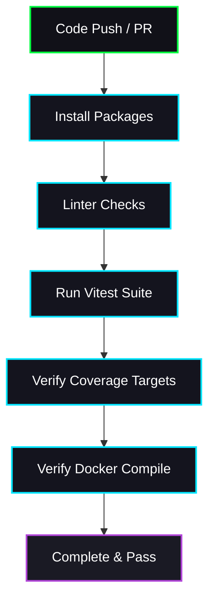

<div align="center">
  

  # DevInspect AI 🔍🤖

  **"Your repository. Professionally judged by sleep-deprived engineers, recruiters, and startup CTOs."**

  [](https://github.com/rishisharma-bca25/devinspect-ai)
  [](https://github.com/rishisharma-bca25/devinspect-ai/actions)
  [](https://github.com/rishisharma-bca25/devinspect-ai)
  [](https://github.com/rishisharma-bca25/devinspect-ai)
  [](./LICENSE.md)
  [](./SECURITY.md)

  [⚡ Live Demo](https://github.com/rishisharma-bca25/devinspect-ai) | [🖥️ GitHub Repository](https://github.com/rishisharma-bca25/devinspect-ai) | [📚 Documentation](./ARCHITECTURE.md)
</div>

---

# 📖 Project Overview

### What is DevInspect AI?
DevInspect AI is an **AI-powered repository intelligence platform** that analyzes codebases, documentation, deployment readiness, testing maturity, open-source quality, and portfolio strength.

It is designed to give developers immediate, transparent feedback on their projects. Rather than showing generic charts and simple line counts, DevInspect AI scans repositories the way real technical professionals do—with skepticism, developer-culture awareness, and deep architectural insight.

### The Problem it Solves
Most automated repository scanners produce dry, static code coverage graphs or simple line percentages. Hiring managers and recruiters don't have time to parse through thousands of lines of raw source code, while developers struggle to keep track of security drift, missing configurations, boilerplate leftovers, and poor documentation files. 

### Why Use DevInspect AI?
* **Recruiter-Ready Social Cards**: Instantly export high-fidelity dashboard screenshots and summary evaluation cards tailored for non-technical hiring managers.
* **Deterministic Rule Validation**: Our parser operates on an evidence-based point score index, giving you clear, reproducible benchmarks for grading repositories.
* **Cyberpunk Console Aesthetic**: Enjoy a handcrafted, retro CRT monitor theme equipped with scanline overlays, typewriter cursors, radial glow centers, and text glitch animations.

---

# 🚀 Key Features

### 🔍 1. Repository Heuristics Analysis
* **Boilerplate Detection**: Automatically flags template boilerplate or cloned tutorials by matching patterns, structure paths, and keywords.
* **Architecture Parsing**: Scans directory structures and files recursively to evaluate layout depth and modular organization.
* **Technical Debt Spectrometer**: Evaluates files count, depth, and commit patterns to forecast long-term code maintainability.
* **Documentation Reviewer**: Measures README density, word count ratios, block codes, and setup checkmarks.
* **Deployment Validation**: Audits config paths, checking for container setups and automation workflows.

### 🎭 2. 5-Persona AI Reviews
Get detailed, highly contextual, and humor-infused feedback from five specialized developer profiles:
* 👨‍💻 **Senior Engineer**: Focuses on clean abstractions, duplicate patterns, file depth, and architectural risks.
* 👔 **Recruiter**: Grades presentation, readme visual polish, badges, and hireability value.
* 🔧 **DevOps Veteran**: Critiques deployment configurations, container health, CI configs, and environment protection.
* 📦 **Open Source Maintainer**: Verifies license files, contributing rules, issue formats, and documentation density.
* 🚀 **Startup CTO**: Focuses on business scaling, tech stacks alignment, and execution velocity.

### 📊 3. 6 Core Quality Metrics
* **Documentation Score**: README formatting, badge configurations, setup guidelines, and screenshot assets.
* **Deployment Confidence**: Infrastructure templates, CI automation files, and host configurations.
* **Portfolio Value**: Unique elements, code originality, and presentation quality.
* **Production Readiness**: Non-root container setups, rate limiting, and dependencies health.
* **Technical Debt Forecast**: Code depth metrics, commit frequencies, and conventions compliance.
* **Open Source Friendliness**: Repository licensing, contributor rules, code-of-conducts, and security structures.

### 💾 4. Canvas-Powered Export Engine
Renders beautiful, downloadable cards directly from your browser using HTML5 Canvas (`html2canvas`):
* **Recruiter Hireability Card** — Clear green-flag checklists and non-technical score summaries.
* **CTO Technical Review Sheet** — Full roadmap layouts, technical debt forecasts, and risk tables.
* **Engineering Scorecard** — Deep metrics breakdowns, roasts, and optimization tasks.

---

# 📸 Screenshot Gallery

### 1. Dashboard Overview


### 2. Repository Analysis


### 3. Persona Reviews


### 4. Architecture Inspection


### 5. Documentation Analysis


### 6. Export System


### 7. Recruiter View


### 8. CTO View


---

# 🗺️ System Architecture

DevInspect AI runs as a single page application with a dedicated backend server. The pipeline parses, fetches, evaluates, and compiles repository diagnostics through 6 core layers:

```mermaid
flowchart LR
    %% Styles
    classDef step fill:#111118,stroke:#00ff41,stroke-width:2px,color:#fff;
    classDef engine fill:#14141e,stroke:#00e5ff,stroke-width:2px,color:#fff;
    classDef output fill:#1a1a24,stroke:#b347d9,stroke-width:2px,color:#fff;

    %% Nodes
    In["Repository Input<br/>(URL Verification)"]:::step
    Fetch["Analysis Engine<br/>(GitHub REST Fetch)"]:::engine
    Rules["Scoring Engine<br/>(Rule-Based Calculations)"]:::engine
    AI["Persona Generator<br/>(Gemini / Heuristics)"]:::engine
    Canvas["Export Engine<br/>(html2canvas Cards)"]:::engine
    Reports["Shareable Reports<br/>(PNG Downloads)"]:::output

    %% Flow
    In --> Fetch --> Rules --> AI --> Canvas --> Reports
```



1. **Repository Input**: Verification checks resolve standard GitHub URLs (`github.com/owner/repository`).
2. **Analysis Engine**: Fetches file trees, README content, contributor lists, commits, and language metrics concurrently.
3. **Scoring Engine**: Evaluates files using deterministic criteria, mapping points to concrete codebase features.
4. **Persona Generator**: Combines AI model inference with structured rule fallbacks to generate persona opinions.
5. **Export Engine**: Uses canvas overlays to package dashboards into downloadable blocks.
6. **Shareable Reports**: Saves documents locally to user machines.

---

# 🏆 How Scoring Works

Our score algorithms are completely transparent and evidence-based. No black-box AI guessing is used to compute grades:

### 📝 Documentation Score (Max: 100)
* **README Presence**: +15 points.
* **Badge Indicators**: Up to +10 points (detects shields.io or custom badges).
* **Visual Elements**: Up to +10 points (detects screenshots or demo animations).
* **Setup Instructions**: Up to +15 points (detects setup, installation, or docker headings).
* **Examples & APIs**: Up to +10 points.
* **Community Files**: Up to +20 points (checks for `CONTRIBUTING`, `CODE_OF_CONDUCT`, and `LICENSE`).

### 🐳 Deployment Score (Max: 100)
* **Dockerfile**: +20 points.
* **Compose File**: +15 points.
* **CI/CD Config**: +15 points (detects GitHub Workflows or GitLab CI).
* **Environment Templates**: +15 points (checks for `.env.example`).
* **Health Checks**: +10 points (verifies health checkers in compose configurations).
* **Lock Files**: +10 points (requires `package-lock.json` or `yarn.lock`).

### 📄 Open Source Score (Max: 100)
* **License File**: +30 points.
* **Contributing Rules**: +20 points.
* **Code of Conduct**: +20 points.
* **Security Advisories**: +15 points (detects `SECURITY.md`).
* **Issue Structures**: +15 points (checks for issue templates).

### 🧪 Testing Score (Max: 100)
* **Testing Libraries**: +30 points (detects Jest, Vitest, Cypress, Mocha, etc.).
* **Test Configurations**: +20 points (detects `.test.js`, `.spec.js`, `vitest.config.js`).
* **Test File Density**: Up to +30 points based on the ratio of tests to source code.
* **Coverage Templates**: +20 points.

---

# 🛠️ Technology Stack

| Layer | Technologies | Role |
| ----- | ------------ | ---- |
| **Frontend Core** | React 19 + Vite 8 | Ultra-fast rendering engine & build tool |
| **Styling** | Vanilla CSS Modules | Isolation-scoped local layouts |
| **Animations** | Motion (Framer Motion) | Hardware-accelerated fluid motion transitions |
| **Backend Core** | Node.js + Express 5 | Fast static file delivery & authentication |
| **AI Processing** | Gemini API (`@google/generative-ai`) | Opinionated LLM evaluations |
| **Unit Testing** | Vitest 4 + `@testing-library/react` | Core logic validation and gauge testing |
| **Deployment** | Docker + Docker Compose | Containerized local production setups |

---

# 💻 Installation & Setup

### 1. Prerequisites
* **Node.js**: Version 20 or higher.
* **GitHub Personal Access Token (PAT)** (Optional but recommended): Raises GitHub unauthenticated API request limit from 60/hr to 5,000/hr.
* **Gemini API Key** (Optional): Activates the AI LLM inspection reviewer.

### 2. Quick Start Command Line
```bash
# Clone the repository
git clone https://github.com/your-username/devinspect-ai.git
cd devinspect-ai

# Install dependencies
npm install

# Create environment config
cp .env.example .env
```

### 3. Execution Commands
* **Development Mode** (Hot-reloading frontend + server):
  ```bash
  npm run dev
  ```
* **Production Build & Execution**:
  ```bash
  # Compile static assets
  npm run build

  # Start the Express server
  npm start
  ```

---

# 🔑 Environment Variables

The application can be configured using environment variables in a `.env` file at the root:

| Variable | Description | Required | Default |
| -------- | ----------- | -------- | ------- |
| **`PORT`** | The port the Node Express server listens on. | No | `3000` |
| **`SESSION_SECRET`** | Secret key used to sign Express session cookies. | Yes | `devinspect-ai-super-secret-key` |
| **`DEVINSPECT_PASSWORD`** | BCrypt hash password used to restrict app access. | No | *None (Public Access)* |
| **`GITHUB_TOKEN`** | Developer PAT to raise GitHub rate limits. | No | *None* |
| **`GEMINI_API_KEY`** | Google AI Gemini key to power AI reviews. | No | *None (Local Fallback)* |

---

# 🐳 Docker Deployment

DevInspect AI includes a multi-stage Docker setup optimized for security, performance, and low footprints.

### 1. Build Production Image
```bash
docker build -t devinspect-ai:latest .
```

### 2. Orchestrate via Docker Compose
* **Start Container**:
  ```bash
  docker compose up -d
  ```
* **Stop Container**:
  ```bash
  docker compose down
  ```

### 3. Container Health Checks
The container includes a built-in health monitor checking endpoint response codes every 30 seconds:
```yaml
healthcheck:
  test: ["CMD", "wget", "--no-verbose", "--tries=1", "--spider", "http://localhost:3000/health"]
  interval: 30s
  timeout: 10s
  retries: 3
```

---

# 🧪 Testing Suite

We use Vitest to validate parsing calculations, regex scanning patterns, and component structures:

* **Execute Unit Tests**:
  ```bash
  npm run test:run
  ```
* **Generate Code Coverage**:
  ```bash
  npm run coverage
  ```
* **Testing Scope**:
  - `metrics.test.js`: Validates the scoring algorithms.
  - `analyzer.test.js`: Confirms secrets scanner checks against test credentials patterns.
  - `common.test.jsx`: Tests circular gauge render paths and count animations.

---

# 🔄 CI/CD Pipeline

We use GitHub Actions to automate checks on pushes and pull requests to `main`. The configuration is defined in `.github/workflows/ci.yml`:



The pipeline blocks integration if linting warnings occur, tests fail, or the Docker multi-stage build breaks.

---

# 🔒 Security Implementation

* **Transient storage**: All inputs (PAT, Gemini API Key) are held in browser `sessionStorage`, keeping them out of cookies or browser databases.
* **Content Security Policy (CSP)**: Helmet.js blocks unauthorized external scripts and locks API connections to `api.github.com` and `generativelanguage.googleapis.com`.
* **Express Rate Limiting**: Prevents API brute-forcing by limiting client IPs to 100 requests per 15 minutes.
* **Secrets Shield**: Regex scanner blocks files parsing if private keys, AWS tokens, or environment structures are exposed.

---

# ⚡ Performance Optimizations

* **Vite Production Bundle**: Compiles assets in **850ms** utilizing optimized rollup bundling.
* **Isolated CSS Modularization**: CSS Modules prevent render blocking and layout shifts.
* **Concurreny Processing**: Queries are dispatched concurrently to GitHub, optimizing latency.

---

# 🗺️ Product Roadmap

* [ ] **GitHub OAuth Support**: Authorize users via GitHub OAuth flow.
* [ ] **Repository Comparison**: Compare multiple projects side-by-side.
* [ ] **Historical Analytics**: Track score drift and progress over time.
* [ ] **Team Collaborations**: Provide joint dashboards for technical reviews.
* [ ] **AST Parsing**: Read JS/Python code trees to detect logic bugs.
* [ ] **Multi-Git Hosting**: Support GitLab and Bitbucket repositories.

---

# 📦 Contributing

We love open-source contributions!
1. Review the [CONTRIBUTING.md](CONTRIBUTING.md) guide.
2. Read the [CODE_OF_CONDUCT.md](CODE_OF_CONDUCT.md).
3. Submit a Pull Request.

---

# 👤 Author

**Rishi Sharma**
* **Role**: BCA Student & Full-Stack Developer
* **Interests**: Client-Side AI integrations, React Design, and DevOps
* **GitHub**: [@rishisharma-bca25](https://github.com/rishisharma-bca25)

---

# 📄 License

This project is licensed under the terms of the [MIT License](LICENSE.md).
